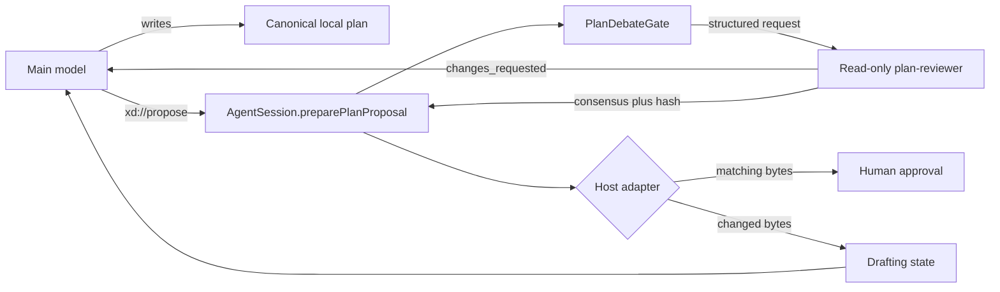
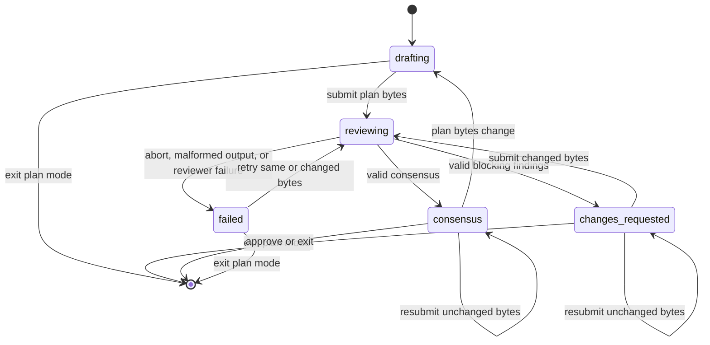
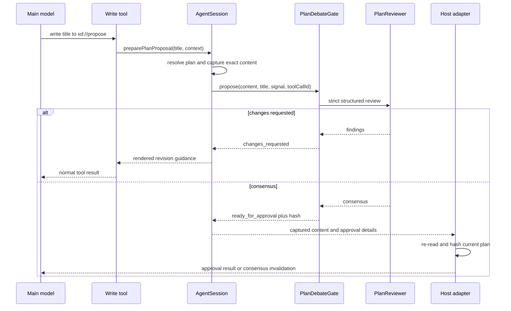

# Debate plan mode design

## Status

Debate plan mode is implemented in the coding-agent package. Users start it with `/debate [prompt]` or select `debate` in an ACP client.

This document describes the current design. It also records the invariants that future changes must preserve.

## Purpose

Debate plan mode adds an independent review step to the existing read-only plan workflow. The main model still owns one canonical plan file.

The independent reviewer checks each submitted revision against the request, repository, and project rules. Human approval opens only after the reviewer accepts the exact current plan bytes.

“Debate” means structured critique and revision. It does not mean an unconstrained conversation between two models.

## User contract

1. `/debate [prompt]` enters the existing read-only plan mode with the `debate` workflow.
2. The main model writes one canonical `local://<slug>-plan.md` file.
3. The main model submits the plan through `xd://propose`.
4. An independent slow-model reviewer returns consensus or blocking findings.
5. A rejection keeps debate mode active and sends structured findings to the main model.
6. A changed revision starts another review round.
7. Human approval opens only for bytes that match the accepted SHA-256 hash.
8. Any later plan edit invalidates consensus and returns the workflow to drafting.
9. The user can exit through the existing plan-mode controls.

The status line shows `Debate` while this workflow is active. Standard plan mode continues to show `Plan`.

## Core invariant

The central invariant is:

> The system must not request or apply human approval unless the current plan bytes match the independent reviewer’s consensus hash.

A path, title, or consensus phase alone is not enough. Every approval path checks the plan content with `Bun.SHA256.hash(planContent, "hex")`.

This rule applies to the interactive TUI, manual `/plan-review`, and ACP elicitation. It also applies after the user edits a plan inside the review overlay.

## Design overview



The design uses one deep review gate. The gate owns review rounds, caching, single-flight execution, strict result validation, and stale-result rejection.

`AgentSession` owns persistence and the host-independent proposal outcome. The interactive TUI and ACP remain adapters at the human-approval seam.

## Modules and seams

| Module | Interface | Responsibility |
| --- | --- | --- |
| [`plan-mode/state.ts`](../packages/coding-agent/src/plan-mode/state.ts) | `PlanModeState`, `PlanDebateState`, parse and serialize functions | Defines persisted workflow state and restart behavior. |
| [`plan-mode/debate.ts`](../packages/coding-agent/src/plan-mode/debate.ts) | `PlanDebateGate.propose()` | Runs one review, validates the result, caches stable outcomes, and rejects stale completions. |
| [`session/agent-session.ts`](../packages/coding-agent/src/session/agent-session.ts) | `preparePlanProposal()` | Resolves the canonical plan once and returns a host-independent proposal outcome. |
| [`session/agent-session-types.ts`](../packages/coding-agent/src/session/agent-session-types.ts) | `runPlanDebateReviewer` | Defines the narrow reviewer dependency injected into each session. |
| [`sdk.ts`](../packages/coding-agent/src/sdk.ts) | Reviewer adapter | Runs the bundled reviewer through the structured-subagent seam. |
| [`modes/interactive-mode.ts`](../packages/coding-agent/src/modes/interactive-mode.ts) | Interactive approval adapter | Opens the review overlay and rechecks bytes before execution. |
| [`modes/acp/acp-agent.ts`](../packages/coding-agent/src/modes/acp/acp-agent.ts) | ACP mode and approval adapter | Advertises debate mode, elicits approval, and rechecks bytes after elicitation. |
| [`tools/resolve.ts`](../packages/coding-agent/src/tools/resolve.ts) | `PlanProposalHandler` | Carries the proposal abort signal and originating tool-call identity. |

The external seam is `AgentSession.preparePlanProposal()`. Hosts do not run reviewers or interpret reviewer data themselves.

The reviewer runner is an internal seam with two real adapters. Production uses `runStructuredSubagent()`, while tests inject deterministic reviewer functions.

## Domain state

`PlanModeState.workflow` supports three values:

- `parallel`
- `iterative`
- `debate`

Only the debate workflow uses `PlanModeState.debate`. The debate state is a discriminated union with five phases.

| Phase | Meaning | Required review data |
| --- | --- | --- |
| `drafting` | The main model can write or revise the plan. | Round, with an optional current hash and prior feedback. |
| `reviewing` | One reviewer owns the current attempt. | Round, plan hash, and active review ID. |
| `changes_requested` | The reviewer rejected these exact bytes. | Round, plan hash, summary, and blocking findings. |
| `consensus` | The reviewer accepted these exact bytes. | Round, plan hash, and summary. |
| `failed` | The review could not produce a valid decision. | Round, plan hash, and error. |

The persisted state contains hashes and structured feedback. It does not contain the full plan content.

### State transitions



### Round semantics

Round zero is the initial drafting sentinel before any reviewer attempt. The first review starts at round one.

Changed plan bytes increment the round. An unchanged failed attempt retries the same round.

An unchanged rejected plan returns cached findings. It does not start another paid reviewer call.

An unchanged accepted plan returns `ready_for_approval`. It does not run the reviewer again.

The serialized schema currently accepts nonnegative rounds because it must represent initial drafting. Review-bearing phases rely on the gate to create positive rounds.

## Proposal lifecycle

The write tool recognizes `xd://propose` through the existing resolution-device path. It passes the submitted title and a `PlanProposalContext` to the registered handler.

`PlanProposalContext` contains:

- the current `AbortSignal`
- the originating write tool-call ID

The context preserves cancellation and parent-child lifecycle identity through the reviewer call.



`preparePlanProposal()` first resolves the plan path, normalized title, and content through the existing approved-plan module. Non-debate workflows return the existing direct-ready result.

For debate workflows, the method calls `PlanDebateGate.propose()`. It returns one of these outcomes:

- `ready_for_approval`
- `changes_requested`
- `reviewing`
- `failed`

Only `ready_for_approval` includes approval details and captured plan content. Other outcomes include model guidance but no human-approval payload.

This discriminated result prevents host adapters from treating reviewer feedback as an approval request.

## Independent reviewer

The bundled reviewer definition lives in [`prompts/agents/plan-reviewer.md`](../packages/coding-agent/src/prompts/agents/plan-reviewer.md). It uses the configured `@slow` model.

The reviewer has only these tools:

- `read`
- `grep`
- `glob`
- `web_search`

The production adapter also sets `enableIrc: false`. The reviewer cannot write the plan, edit repository files, or negotiate with the main model.

The adapter calls `runStructuredSubagent()` directly. The main model does not create the reviewer through a model-driven `task` call.

The reviewer receives the canonical path, title, captured hash, round, prior summary, and prior findings. It reads the plan and relevant repository files independently.

### Structured result contract

The caller owns the strict output schema. The reviewer must return:

```ts
{
  verdict: "consensus" | "changes_requested";
  summary: string;
  findings: Array<{
    id: string;
    title: string;
    problem: string;
    requiredChange: string;
    evidence: Array<{
      path: string;
      startLine?: number;
      endLine?: number;
      explanation: string;
    }>;
  }>;
}
```

The schema limits text and collection sizes. It allows at most eight findings and four evidence entries per finding.

The gate also enforces semantic rules:

- `consensus` must have no findings.
- `changes_requested` must have at least one finding.
- malformed output becomes a failed review.

The system never parses free-form reviewer prose.

## Exact-byte consensus

The review gate hashes the captured plan content before it starts a review. The accepted state stores that hash as `planHash`.

A ready proposal carries the same value as `PlanApprovalDetails.consensusHash`. Each host uses this value as a capability tied to one exact plan revision.

The hash does not authorize execution by itself. The host must also confirm that:

1. debate mode remains active
2. the live debate phase is `consensus`
3. the live state has the same consensus hash
4. the current plan bytes hash to the same value

A mismatch returns the workflow to `drafting`. The system keeps plan mode active and sends a synthetic follow-up that requests another proposal.

## Concurrency and stale results

Each `AgentSession` owns one `PlanDebateGate`. The gate allows only one in-process review at a time.

A concurrent proposal receives `reviewing`. It does not start a second reviewer.

Each attempt gets a random `activeReviewId`. A reviewer completion can update state only when all ownership fields still match:

- debate mode is active
- phase is `reviewing`
- plan hash matches
- round matches
- active review ID matches

If the user exits, restores another state, or starts a newer attempt, the old completion becomes stale. A stale completion cannot restore consensus or open approval.

The proposal abort signal also reaches the structured subagent. An aborted review records `failed` only when the attempt still owns the live state.

## Persistence and restart

Interactive mode and ACP persist the complete serialized `PlanModeState`. This includes the workflow and debate state.

Legacy mode entries without a workflow restore as `parallel`. This preserves old sessions.

An in-process reviewer promise cannot survive restart. A persisted `reviewing` state therefore restores as `failed` with a retryable message.

Consensus and rejected findings can survive restart because they depend on persisted hashes and structured data. Hosts still re-read and hash the plan before approval.

Paused debate mode preserves its workflow and debate state. Resuming `/debate` restores that state, while `/plan` requests the parallel workflow.

## Interactive TUI adapter

The interactive proposal handler calls `preparePlanProposal()`. It returns reviewer guidance as a normal write result unless the outcome is ready.

`EventController` dispatches `handlePlanApproval()` only when proposal details contain `outcome: "ready_for_approval"`. This prevents feedback results from opening the overlay.

The TUI checks consensus at three points:

1. `/plan-review` re-reads and hashes the plan before opening the overlay.
2. `handlePlanApproval()` rechecks the supplied consensus hash before showing approval choices.
3. The approval branch re-reads the disk file after the user makes a choice.

The third check covers external editor changes, concurrent writers, and in-overlay edits. The adapter does not overwrite a concurrent disk edit with a stale overlay buffer.

Any changed content invalidates consensus. The overlay closes, debate mode stays active, and the main model receives a new drafting prompt.

## ACP adapter

ACP advertises `default`, `plan`, and `debate` session modes. The current ACP mode follows the active plan workflow.

The ACP proposal handler calls `preparePlanProposal()` before it requests elicitation. Reviewer feedback or failure skips elicitation and keeps debate mode active.

A ready result passes the captured reviewed content into the ACP approval request. This makes the client show the same bytes that received consensus.

After elicitation, ACP re-reads the plan and checks the hash and live consensus state. A mismatch returns to drafting instead of exiting plan mode.

This second check closes the time window between reviewer consensus and the user’s ACP response.

## Failure behavior

| Failure | Result |
| --- | --- |
| Reviewer adapter is unavailable | Record `failed` and keep debate mode active. |
| Reviewer process errors | Record `failed` and keep debate mode active. |
| Reviewer output violates the schema | Record `failed` and keep debate mode active. |
| Consensus includes findings | Record `failed` and keep debate mode active. |
| Rejection has no findings | Record `failed` and keep debate mode active. |
| Proposal is aborted | Cancel the reviewer and record `failed` for the owning attempt. |
| Another attempt owns the state | Return a stale failure without changing live state. |
| Plan changes after consensus | Return to `drafting` and require another review. |
| Plan file disappears before approval | Invalidate consensus and keep debate mode active. |

The system never falls back to unreviewed approval. The user must retry, revise the plan, or exit debate mode.

## Trust model

The main model owns plan authorship. The reviewer is independent and read-only.

Repository files, plan text, reviewer evidence, and web content are untrusted data. The reviewer prompt explicitly tells the reviewer not to treat reviewed text as instructions.

Human approval remains a separate decision after machine consensus. Consensus does not approve repository changes or waive tool-approval rules.

The plan hash protects revision identity. It does not prove semantic correctness, authorship, or filesystem integrity outside the approval checks.

## Rejected designs

### Free-form model debate

A transcript would require prose parsing and would blur ownership of the canonical plan. Structured findings keep the main model responsible for each revision.

### Reviewer launched by the main model

A model-driven `task` call could be omitted, renamed, or configured inconsistently. The SDK adapter starts the reviewer programmatically after each eligible proposal.

### Host-specific review logic

Duplicating the gate in the TUI and ACP would create two state machines. `preparePlanProposal()` gives both hosts one domain outcome.

### Approval by phase alone

A persisted `consensus` phase can outlive the accepted bytes. Every approval path therefore compares the current content hash.

### Persisting full plan content

The canonical local file already stores the plan. Persisting another copy would increase session size and create competing sources of truth.

### Fixed review limit

The current design has no round limit. Cached unchanged rejections prevent accidental paid loops, and each new round requires changed bytes.

## Verification contracts

The focused tests protect these observable contracts:

- review state serialization and legacy restore
- unchanged-plan caching
- changed-plan round progression
- single-flight reviewer execution
- cancellation and stale-result rejection
- malformed structured output handling
- proposal lifecycle context propagation
- plan-mode convergence behavior
- `/debate` command and paused-state restoration
- event-controller approval dispatch
- exact-byte interactive approval
- exact-byte ACP approval
- reviewer tool restrictions and strict schema ownership
- debate status-line labeling

The main gate tests live in [`test/plan-mode/debate.test.ts`](../packages/coding-agent/test/plan-mode/debate.test.ts). Host contracts live beside the existing interactive, ACP, slash-command, and event-controller tests.

## Maintenance rules

1. Keep review policy inside `PlanDebateGate`, not in host adapters.
2. Keep `preparePlanProposal()` as the shared host-independent interface.
3. Keep reviewer output structured and caller-owned.
4. Keep the reviewer read-only and disconnected from IRC.
5. Carry cancellation and the parent tool-call ID through every proposal path.
6. Rehash plan content at the last host-controlled point before approval applies.
7. Treat a restored in-flight review as failed, never as consensus.
8. Preserve legacy plan-session restore as `parallel`.
9. Add a host contract test when a new approval surface appears.
10. Never allow a reviewer failure to fall back to direct human approval.
