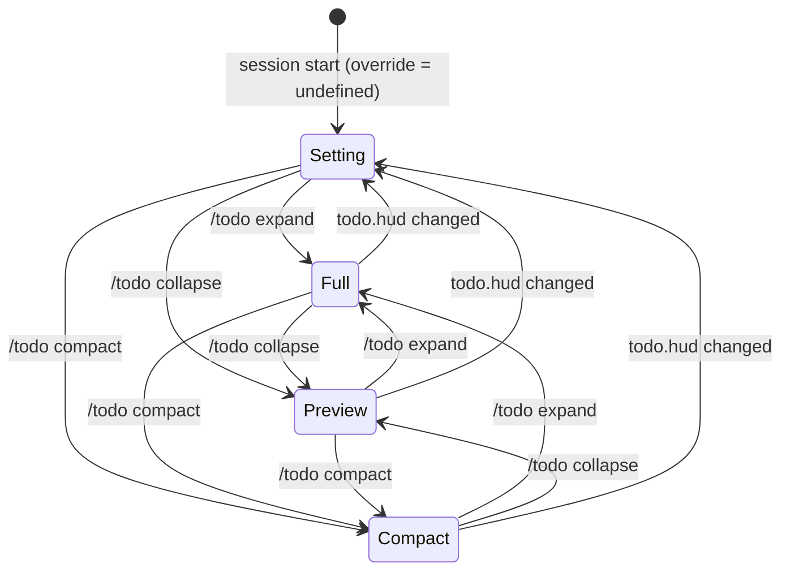

# Data Model: Compact Todo HUD

The feature adds no persisted data. The state lives in `InteractiveMode` for the life of the session. One setting is added.

## TodoHudLayout

`"full" | "preview" | "compact"`

| Value | Text-terminal HUD | Native HUD fallback tree |
|---|---|---|
| `full` | Every phase and every task (was `todoExpanded = true`) | Every phase open |
| `preview` | Bounded tree (was `todoExpanded = false`) | Active phase open |
| `compact` | No HUD rows. Summary on the status row. | Same as `preview` |

## Start layout setting

- **Key:** `todo.hud`
- **Values:** `preview`, `compact`. There is no `full`, because Full is only for commands.
- **Default:** `preview`
- **Source:** the layered YAML config. A change applies live through the settings-change handler.

## Layout state (InteractiveMode)

| Field | Type | Meaning |
|---|---|---|
| `#todoLayoutOverride` | `{ sessionId: string; layout: TodoHudLayout } \| undefined` | Set by `/todo expand` \| `collapse` \| `compact`, tagged with the id of the main session. `undefined`, or a tag from another session, follows `todo.hud`. |
| `todoLayout` (getter) | `TodoHudLayout` | Selected layout: the override layout when its `sessionId` matches `this.session`, else `cfgTodoHud.get(settings)`. It replaces the public `todoExpanded` field in `InteractiveModeContext`. |
| displayed layout (computed) | `TodoHudLayout` | `rows < 18 ? "compact" : todoLayout`. It is not stored. `isCompactTodoMode()` returns `displayed === "compact"`. |

## Transitions

`Setting` means the value of `todo.hud`, which is `preview` or `compact`. Terminal height never changes this state. It changes only the displayed layout.

## Compact summary

These values are computed when the status row renders. Only the open phases of `todoPhases` are used.

| Part | Source | Style |
|---|---|---|
| Label | `"TODO"` | bold accent |
| Progress | `closed/total` over every phase. `closed` counts `completed` and `abandoned` tasks. | dim |
| Current task | `nextActionableTask(phases) ?? first blocked task`, drawn with `#formatTodoLine`. If no open task exists: `☑ done`. | status color |
| Blocked suffix | `· N blocked` when N > 0 | warning |

**Suppressed when:** there is no task, or `#todoHudHidden` is true.
