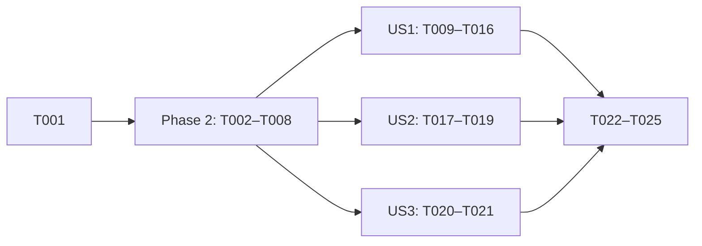

---

description: "Task list for the Compact Todo HUD"
---

# Tasks: Compact Todo HUD

**Input**: Design documents from `/specs/006-compact-todo-hud/`

**Prerequisites**: [plan.md](./plan.md), [spec.md](./spec.md), [research.md](./research.md), [data-model.md](./data-model.md), [contracts/](./contracts/)

**Tests**: Included. The global `AGENTS.md` requires property tests, and [research.md D9](./research.md#d9--what-the-tests-must-prove) defines them. Use a fixed seed, print it, and print the smallest failing input.

**Organization**: Tasks are grouped by user story. Each story can be built and tested alone after Phase 2.

## Format: `[ID] [P?] [Story] Description`

- **[P]**: Can run in parallel (different files, no dependency on an unfinished task).
- **[Story]**: The user story that the task belongs to (US1, US2, US3).
- All source paths are under `packages/coding-agent/` unless the path starts with `/` or `~`.

---

## Phase 1: Setup

**Purpose**: Record the test baseline before any change.

- [X] T001 Run `bun test test/interactive-mode-todo-clear.test.ts test/input-controller-escape.test.ts test/acp-builtins.test.ts test/tools/todo.test.ts` in `packages/coding-agent/`. Record which tests fail before the change, so later failures can be told apart from existing ones.

---

## Phase 2: Foundational (Blocking Prerequisites)

**Purpose**: Replace the `todoExpanded` boolean with the three-value layout state. Every story needs it.

**⚠️ CRITICAL**: No user story work can start until this phase is complete.

- [X] T002 [P] Register `cfgTodoHud` in `src/tools/settings.ts` after `cfgTodoEager`.
  - `id: "todo.hud"`, `type: "enum"`, `values: ["preview", "compact"] as const`, `default: "preview"`.
  - `ui`: `tab: "tools"`, `group: "Todos"`, `label: "Todo HUD Layout"`.
  - Options: `preview`, described as "Bounded task tree above the editor". `compact`, described as "One line on the status row".
  - See research D4.
- [X] T003 [P] In `src/modes/types.ts`:
  - Export `type TodoHudLayout = "full" | "preview" | "compact"`.
  - In `InteractiveModeContext`, replace `todoExpanded: boolean` (`:194`) with `readonly todoLayout: TodoHudLayout`.
  - Replace `toggleTodoExpansion(): void` and `setTodoExpanded(expanded: boolean): void` (`:423–424`) with `setTodoLayout(layout: TodoHudLayout): void`.
- [X] T004 In `src/modes/interactive-mode.ts`, add the layout state (research D2, D3, data-model.md):
  - Delete the `todoExpanded` field (`:1111`).
  - Add `#todoLayoutOverride: { sessionId: string; layout: TodoHudLayout } | undefined`.
  - Add a `get todoLayout(): TodoHudLayout` getter. It returns the override layout only when `sessionId === this.session.sessionManager.getSessionId()`. Otherwise it returns `cfgTodoHud.get(settings)`.
  - Change `isCompactTodoMode()` (`:4187`) to return `this.todoLayout === "compact" || rows < TODO_COMPACT_TERMINAL_ROWS_THRESHOLD`.
  - In `#renderTodoList` (`:3991`), set `const expanded = this.todoLayout === "full"`.
- [X] T005 In `src/modes/interactive-mode.ts`, replace `toggleTodoExpansion` and `setTodoExpanded` (`:8139–8187`) with `setTodoLayout(layout)`.
  - Store the override, tagged with the current main-session id.
  - When `layout !== "preview"`, run the existing reveal block: cancel the auto-clear timer, set `#todoHudHidden = false`, and persist a `revealed` entry. Keep the settle-then-persist path as it is.
  - Always call `#renderTodoList()` and `ui.requestRender()`.
  - Delete `toggleTodoExpansion`. It has no other caller.
- [X] T006 In `src/modes/controllers/todo-command-controller.ts` (`:159–164`), map `expand` to `setTodoLayout("full")` and `collapse` to `setTodoLayout("preview")`. Delete the `todoExpanded` check.
- [X] T007 [P] In `test/input-controller-escape.test.ts` (`:216`), delete the `toggleTodoExpansion: vi.fn()` mock entry.
- [X] T008 In `test/interactive-mode-todo-clear.test.ts` (`:572`), delete the direct `mode.todoExpanded = true` assignment. The existing `handleTodoCommand("expand")` call on the next line already sets the layout. Then run `bun test test/interactive-mode-todo-clear.test.ts` and make sure the existing expand and collapse tests (`:733–743`) still pass.

**Checkpoint**: The type check passes. `expand` and `collapse` work as before, and no caller uses `todoExpanded`.

---

## Phase 3: User Story 1 - Fold the todo HUD to one line on demand (Priority: P1) 🎯 MVP

**Goal**: `/todo compact` removes the HUD rows. The status row then shows `TODO a/b · <current task> · N blocked` ([contracts/compact-summary.md](./contracts/compact-summary.md)).

**Independent Test**: Create a plan with two phases and six tasks, one in progress and one blocked. Run `/todo compact`. `todoContainer.render(120)` returns no rows. The last status-HUD row contains `3/6`, the in-progress task text, and `1 blocked`.

### Tests for User Story 1 (write first, make sure they fail)

- [X] T009 [US1] In `test/interactive-mode-todo-clear.test.ts`, add a property test for the displayed layout (research D9.1).
  - Use a seeded generator for command sequences over `{expand, collapse, compact}` and terminal heights over `{10, 17, 18, 40}`.
  - After each step, assert that the HUD rows are empty if and only if (the selected layout is `compact`) or (rows < 18).
  - Also assert that the last selected layout shows after the terminal grows.
  - Control the height only in the test (plan.md → Test access to height).
- [X] T010 [US1] In `test/interactive-mode-todo-clear.test.ts`, add a property test for the width bound (research D9.2, compact-summary.md invariants 1–3).
  - Use seeded widths 20–300, task lengths 0–400, and `childLines` last-row lengths 0–200.
  - Assert `visibleWidth(last row) <= width`.
  - Assert that the left row stays whole when `width - leftWidth - fixed >= 12`.
  - Print the seed and the smallest failing input.
- [X] T011 [US1] In `test/interactive-mode-todo-clear.test.ts`, add a property test for the current task (research D9.3, compact-summary.md invariants 4–5).
  - Use seeded status mixes over several phases.
  - The summary names the first `in_progress` task, else the first `pending` task, else the first `blocked` task.
  - `☑ done` shows only when every task is closed.
  - The `N blocked` suffix shows exactly when N > 0.
- [X] T012 [US1] In `test/interactive-mode-todo-clear.test.ts`, add two tests.
  - **Hidden HUD** (D9.5): after the HUD is dismissed or auto-cleared, `renderCompactStatusLine` returns `childLines` without change.
  - **Session scope** (FR-009): run `/todo compact`, then start a new session with `/new` or a session replacement. `todoLayout` then equals the `todo.hud` setting.

### Implementation for User Story 1

- [X] T013 [US1] In `src/modes/controllers/todo-command-controller.ts`:
  - Add `case "compact": this.ctx.setTodoLayout("compact"); return;`.
  - Add the usage row after `collapse`: `  /todo compact                      Fold the HUD into one status-row line` ([contracts/todo-command.md](./contracts/todo-command.md)).
- [X] T014 [US1] In `src/modes/interactive-mode.ts` `renderCompactStatusLine` (`:4192`), change the content (research D5, D7):
  - Return `childLines` early when `#todoHudHidden` is true.
  - Set the current task to `nextActionableTask(phases) ?? first task with status "blocked"`. Do not change `nextActionableTask` in `src/tools/todo.ts`.
  - After the task, append `theme.fg("dim", "·")` and then `theme.fg("warning", `${n} blocked`)` when the blocked count n > 0.
- [X] T015 [US1] In `src/modes/interactive-mode.ts` `renderCompactStatusLine`, change the shortening order (research D6):
  - Add `MIN_TASK_CELLS = 12` next to `TODO_COMPACT_TERMINAL_ROWS_THRESHOLD` (`:628`).
  - Compute `fixed` = the width of the header, the separators, and the blocked suffix.
  - Cut only the task string to `taskBudget = width - leftWidth - minGap - fixed - 1`, when that value is at least `MIN_TASK_CELLS`.
  - Otherwise, cut the task to `MIN_TASK_CELLS` and shorten the left part, as today.
  - As a final guard, cut `combinedLine` to `width`.
  - Delete the 45% cap.
- [X] T016 [US1] Run `bun test test/interactive-mode-todo-clear.test.ts`. T009–T012 must pass.

**Checkpoint**: `/todo compact` works on a normal-size terminal. The short-terminal fold now has the new summary.

---

## Phase 4: User Story 2 - Make Compact the start layout (Priority: P2)

**Goal**: `todo.hud: compact` starts sessions in Compact. A live setting change applies at once and clears the command override.

**Independent Test**: Set `todo.hud` to `compact` in the test settings and create a plan. The HUD rows are empty. Run `/todo collapse`, and the tree shows. Change `todo.hud` to `preview`. The override is cleared and the tree shows.

### Tests for User Story 2

- [X] T017 [US2] In `test/interactive-mode-todo-clear.test.ts`, add a precedence test (research D9.4).
  - The setting alone selects the start layout.
  - A command overrides the setting.
  - A `todo.hud` change clears the override. Test both a change to a new value and a change to the same value.

### Implementation for User Story 2

- [X] T018 [US2] In `src/modes/interactive-mode.ts`:
  - Add `#applyTodoHudSetting()`. It sets `#todoLayoutOverride = undefined`, calls `#renderTodoList()`, and calls `ui.requestRender()`. Copy `applyPinnedAgentsSetting` (`:1526`).
  - In the settings-change handler, add `if (any("todo.hud")) this.#applyTodoHudSetting();` next to `display.pinnedAgents` (`:3359`).
- [X] T019 [P] [US2] Add `todo.hud: preview` under the `todo:` key in `~/.omp/agent/config.yml`. Create the key if it is missing, and keep the other entries. This follows the `.omp/AGENTS.md` local rule.

**Checkpoint**: US1 and US2 both work alone.

---

## Phase 5: User Story 3 - Find the new layout in help (Priority: P3)

**Goal**: Both `/todo` usage texts list `compact`. ACP refuses it the same way it refuses `expand` and `collapse`.

**Independent Test**: `executeAcpBuiltinSlashCommand("/todo compact", runtime)` returns `{ consumed: true }`, and the output contains `interactive HUD`. The TUI usage text contains `/todo compact`.

### Tests for User Story 3

- [X] T020 [P] [US3] In `test/acp-builtins.test.ts` (`:910`), extend the `/todo expand` HUD-only case to run for `expand`, `collapse`, and `compact`.

### Implementation for User Story 3

- [X] T021 [P] [US3] In `src/slash-commands/helpers/todo.ts`:
  - Add `case "compact":` to the `expand`/`collapse` refusal (`:280–282`).
  - Add the usage row after `collapse` (`:109`): `  /todo compact                      (TUI only) fold the sticky HUD to one line`.

**Checkpoint**: All stories work alone.

---

## Phase 6: Polish & Cross-Cutting Concerns

- [X] T022 [P] In `docs/tools/todo.md` (`:124`), document `/todo compact` next to `expand` and `collapse`. Also document the `todo.hud` setting (`preview` | `compact`, default `preview`) and the short-terminal override.
- [X] T023 [P] In `UPSTREAM_DIVERGENCES.md`, add a `### Compact todo HUD` entry that follows the existing format:
  - **Decision:** `todo.hud`, `/todo compact`, the blocked count and blocked fallback, and the shortening order that cuts the task first.
  - **Why:** the Preview tree used 9 or more rows on long plans.
- [X] T024 Run `PATH="$HOME/.cargo/bin:$PATH" bun check > /tmp/check.log 2>&1; echo rc=$?` from the repository root. Report the exit code. Fix only the failures that this change caused. Compare them with the T001 baseline.
- [X] T025 Smoke the real TUI through `xd://tui` or a real terminal. Follow [quickstart.md](./quickstart.md) steps 1–7, and capture the output of steps 2, 3, and 5.

---

## Dependencies & Execution Order



- **Phase 2 order:** T002 and T003 can run in parallel. T004 needs both. T005 needs T004. T006 needs T003. T007 needs T003. T008 needs T005 and T006.
- **US1:** T009–T012 come first and must fail. Then T013, T014, and T015. T014 and T015 edit the same method, so run them in sequence. T016 comes last.
- **US2:** T017, then T018. T019 does not depend on them.
- **US3:** Its files are separate from US1 and US2, so it can run in parallel with them.
- **Same-file conflicts:** T009–T012 and T017 all edit `test/interactive-mode-todo-clear.test.ts`. T004, T005, T014, T015, and T018 all edit `src/modes/interactive-mode.ts`. Do not run tasks that edit the same file at the same time.

## Parallel Examples

```text
# Phase 2 start
T002 src/tools/settings.ts   ||  T003 src/modes/types.ts

# After Phase 2
US1 (interactive-mode.ts + controller + todo-clear test)
  || US3: T020 test/acp-builtins.test.ts  ||  T021 src/slash-commands/helpers/todo.ts
  || T019 ~/.omp/agent/config.yml

# Polish
T022 docs/tools/todo.md  ||  T023 UPSTREAM_DIVERGENCES.md
```

## Implementation Strategy

- **MVP:** Phase 2 and US1 (T001–T016). This alone answers the request: `/todo compact` folds the HUD to one line.
- **Next:** US2 makes Compact the default through the config. US3 finishes the help text and the ACP refusal.
- **Last:** Polish (T022–T025). Do not report the work as done without the `bun check` exit code and the TUI smoke output.

---

## Phase 7: Convergence

- [X] T026 In `src/modes/interactive-mode.ts` `StatusHudContainer.#renderLines`, keep the idle status row (`renderIdleStatusHud`) in the Compact layout when the summary adds nothing (no plan, or the HUD is dismissed or auto-cleared), and add a test in `test/interactive-mode-todo-clear.test.ts` per Edge Cases: No plan (partial)
