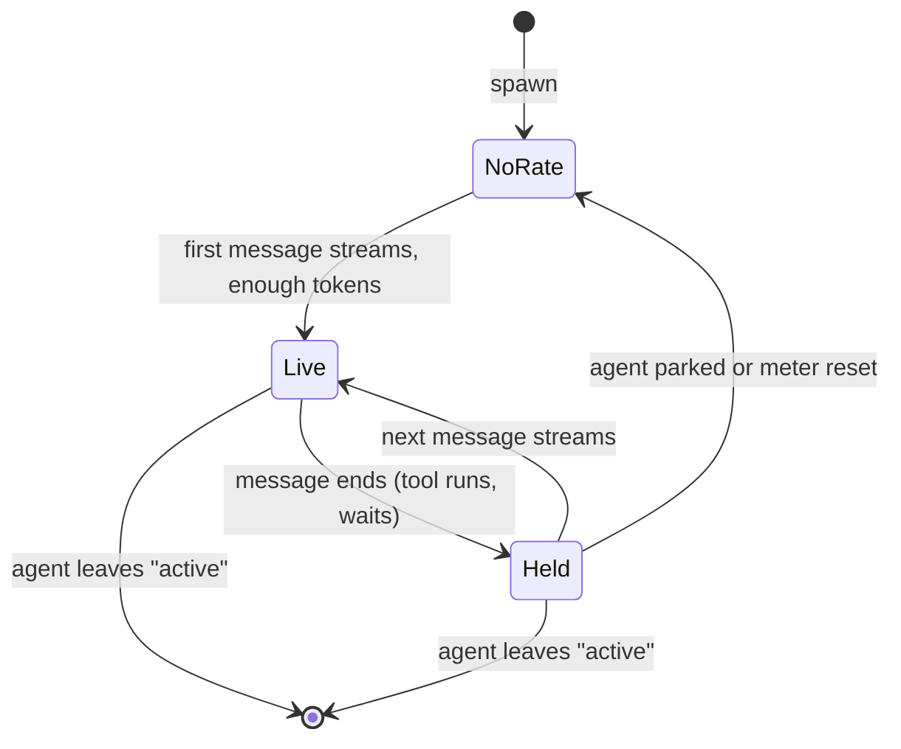

# Data Model: Subagent Generation Rate in the Subagents HUD

The feature adds no stored data. It reads values in memory at render time.

## SubagentRate (render input, per agent)

| Field | Type | Source | Meaning |
|---|---|---|---|
| `rate` | `number` | `session.tokenRate.rate()` | Tokens per second, more than 0. When the meter returns `null`, the lookup gives no entry. |
| `live` | `boolean` | `session.tokenRate.live` (new getter) | True while a model message streams (between `begin` and `end`). False between requests. |

**Lookup**: `(id: string) => SubagentRate | undefined`. It gives `undefined` when one of these is true:
- `composer.tokenRate` is off.
- The registry has no entry for `id`, or the entry has no session (the agent is parked).
- `rate()` returns `null`, because the meter does not have enough tokens yet.

## States of one row

| State | Row shows | Counts in header total |
|---|---|---|
| NoRate | nothing | no |
| Live | `icon value` in `muted` | yes |
| Held | `icon value` in `dim` | no |

## SubagentTotalRate (header)

- The value is the sum of `rate` for every running HUD agent with `live = true`. This includes agents in collapsed rows.
- The header shows the total only when one or more agents are live.

## Validation rules

- Format the value with `toFixed(1)`. Do not round it in any other way.
- A row shows the rate text in full or not at all (R5).
- The header text is `icon value tok/s`. It follows FR-002 and is the same as the working row.
