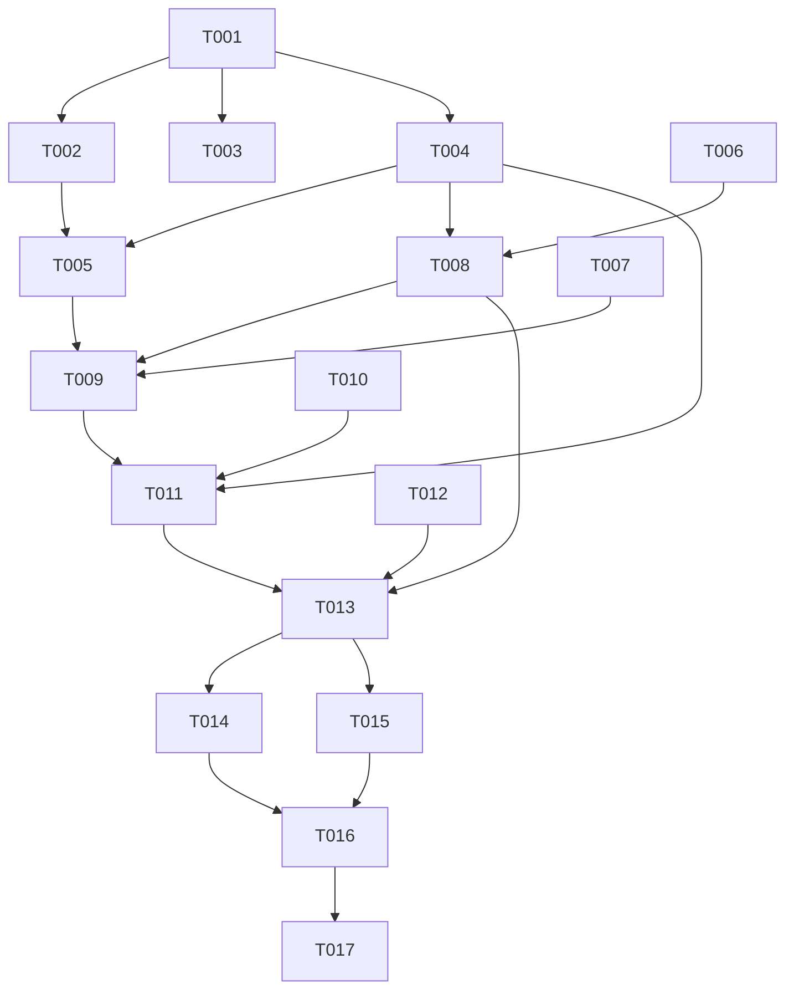

---

description: "Task list for Subagent Generation Rate in the Subagents HUD"
---

# Tasks: Subagent Generation Rate in the Subagents HUD

**Input**: Design documents from `specs/007-subagent-token-rate/`

**Prerequisites**: plan.md, spec.md, research.md, data-model.md, contracts/subagent-hud-rate.md, quickstart.md

**Tests**: Included. The repository rules (`AGENTS.md`) require one runnable check for each non-trivial logic change. research.md R7 lists the properties to test. Write each test first, and make sure it fails before you implement.

**Organization**: Tasks are grouped by user story, so you can test each story separately.

## Format: `[ID] [P?] [Story] Description`

- **[P]**: The task can run in parallel with other tasks (different files, no open dependencies).
- **[Story]**: The user story for this task (US1, US2, US3).
- All paths are relative to the repository root. All source changes are in `packages/coding-agent/`.

---

## Phase 1: Setup (Shared Infrastructure)

**Purpose**: Get a green baseline before you change anything.

- [X] T001 Run `bun test packages/coding-agent/test/subagent-hud-render.test.ts packages/coding-agent/test/utils/token-rate-meter.test.ts`, and record that both files pass. If `cargo` is not found, put `$HOME/.cargo/bin` first in `PATH`.

---

## Phase 2: Foundational (Blocking Prerequisites)

**Purpose**: Add the meter's live flag and the rate lookup that all stories use.

**⚠️ CRITICAL**: Complete this phase before you start a user story.

- [X] T002 [P] Add `get live(): boolean { return this.#startedAt !== null; }` to `TokenRateMeter` in `packages/coding-agent/src/utils/token-rate.ts`. Write a one-line doc comment: "True while a message streams (between begin and end)."
- [X] T003 [P] Add one case to `packages/coding-agent/test/utils/token-rate-meter.test.ts`. It must show that `live` is false on a new meter and true after `begin(t)` and after `push(text, t)` without `begin`. It must show that `live` is false after `end(...)`, after `reset()` and after `seed(...)`, and that `rate()` still returns the held value after `end`.
- [X] T004 [P] In `packages/coding-agent/src/modes/interactive-mode.ts`, export `interface SubagentRate { rate: number; live: boolean }`. Add an optional 4th parameter `rateOf?: (id: string) => SubagentRate | undefined` to `renderSubagentHudLines`. Do not change the output yet. Update the function doc comment.
- [X] T005 In `#renderSubagentList` in `packages/coding-agent/src/modes/interactive-mode.ts`, build `rateOf` only when `cfgComposerTokenRate.get(settings)` is true. For an id, read `AgentRegistry.global().get(id)?.session?.tokenRate`. Return `undefined` if there is no meter or `rate()` is `null`. Otherwise return `{ rate, live: meter.live }`. Pass the lookup as the 4th argument. This depends on T002 and T004.

**Checkpoint**: The meter has a live flag, and the HUD gets a rate lookup. The rendered output does not change yet.

---

## Phase 3: User Story 1 - See each running subagent's generation rate (Priority: P1) 🎯 MVP

**Goal**: Each Subagents row shows its agent's rate after the name and role badge. The rate is `muted` while live and `dim` while held. The block redraws the rate at least once each second while an agent streams.

**Independent Test**: Turn on the Generation Rate setting. Start two streaming subagents. Each row shows `⚡ NN.N` and follows the stream. A row that runs a tool keeps its last reading in the dimmed style.

### Tests for User Story 1

- [X] T006 [US1] Add a `describe("rates")` block to `packages/coding-agent/test/subagent-hud-render.test.ts` and write these cases:
  - (a) A live rate `{ rate: 32.46, live: true }` renders `${theme.icon.throughput} 32.5` after the id and before `: description`, in `theme.fg("muted", …)`.
  - (b) A held rate renders the same text in `theme.fg("dim", …)`.
  - (c) When `rateOf` returns `undefined`, the row has no rate.
  - (d) The output without `rateOf` is equal to the output with a `rateOf` that always returns `undefined`, and both are equal to the current output (SC-006).
  - (e) Property sweep with a fixed, printed seed. Use widths 30–160, generated rates 0.1–9999.9 and long descriptions. Every line is at most `width` columns. Each row has the full rate text or no rate text, never a partial number.
- [X] T007 [US1] Add two tests to the `InteractiveMode subagent observer UI sync` suite in `packages/coding-agent/test/subagent-hud-render.test.ts`. Both turn on `composer.tokenRate`, register the suite's `AgentSession` in `AgentRegistry.global()`, and use fake timers.
  1. Freshness: stream slowly, emit a progress frame, and read the shown rate. Stream faster, emit a frame, and assert a higher rate. Turn the setting off, emit a frame, and assert no rate (FR-008).
  2. Cadence: with no frames, assert one or more rebuilds in each 1000 ms window (SC-003). With frames every 200 ms for 2 s, assert no more than 10 rebuilds. Call `end()`, advance 500 ms, then advance 2000 ms and assert 0 rebuilds (FR-010).

### Implementation for User Story 1

- [X] T008 [US1] In `renderItem` of `renderSubagentHudLines` in `packages/coding-agent/src/modes/interactive-mode.ts`, after the `badge` step and before the description and task-preview budget, call `rateOf?.(session.id)`. If it returns a value, build `${theme.icon.throughput} ${rate.toFixed(1)}`, styled `muted` when live and `dim` when held. Append `" " + text` to `line` only when `visibleWidth(line) + 1 + visibleWidth(text) <= rowWidth`. The existing budget code then makes the description shorter. This depends on T004.
- [X] T009 [US1] Add a heartbeat in `packages/coding-agent/src/modes/interactive-mode.ts`:
  1. Add `#subagentRateTimer` and `SUBAGENT_HUD_RATE_REFRESH_MS = 500` next to `SUBAGENT_OBSERVER_UI_COALESCE_MS`.
  2. At the start of `#renderSubagentList`, clear the timer. At the end, arm a single-shot `setTimeout` with `.unref?.()` when one or more meters are live. The callback calls `#renderSubagentList()` and `this.ui.requestRender()`.
  3. Clear the timer in `#cancelObserverUiSyncTimer()`.

**Checkpoint**: T003, T006 and T007 pass. US1 works in the real TUI (quickstart.md steps 1–7).

---

## Phase 4: User Story 2 - See the total rate of all subagents (Priority: P2)

**Goal**: The header shows `icon sum tok/s` for the live agents, including agents in collapsed rows. Held rates do not count.

**Independent Test**: Start more than 3 subagents and keep the block collapsed. The header total includes agents in the "… N more" group. When no agent streams, the header shows only `Subagents`.

### Tests for User Story 2

- [X] T010 [US2] Add header cases to the `describe("rates")` block in `packages/coding-agent/test/subagent-hud-render.test.ts`:
  - (a) Use 10 agents in collapsed mode. Some are live, some are held and some have no rate. The header equals `Subagents  ${theme.icon.throughput} ${expected.toFixed(1)} tok/s`, where `expected` is the sum of the live rates over all 10 agents.
  - (b) When all agents are held or have no rate, the header is exactly the current `Subagents` header.
  - (c) The header line is at most `columns` wide for widths 10–160.

### Implementation for User Story 2

- [X] T011 [US2] In `renderSubagentHudLines` in `packages/coding-agent/src/modes/interactive-mode.ts`, sum `rateOf(id).rate` over all `running` agents with `live === true`. If the sum is more than 0, append `"  " + theme.fg("dim", `${theme.icon.throughput} ${sum.toFixed(1)} tok/s`)` to the bold `Subagents` header before `truncateToWidth(…, columns)`. This depends on T004.

**Checkpoint**: T010 passes. US1 and US2 both work.

---

## Phase 5: User Story 3 - The rate uses the same symbol as the working row (Priority: P2)

**Goal**: The row and header rates use `theme.icon.throughput`, and they follow `symbolPreset`.

**Independent Test**: Change `symbolPreset` to `unicode`, then `nerd`, then `ascii`. For each preset, the HUD symbol is the same as the working-row symbol.

### Tests for User Story 3

- [X] T012 [US3] Add a preset case to `packages/coding-agent/test/subagent-hud-render.test.ts`. For each preset in `["unicode", "nerd", "ascii"]`, call `await initTheme(false, preset)` and render one live row. Assert that the row and the header contain `theme.icon.throughput`, and that the Unicode glyph `⚡` shows only for `unicode`. Call `initTheme()` in `finally` to restore the default theme.

### Implementation for User Story 3

- [X] T013 [US3] Check that every rate string in `renderSubagentHudLines` in `packages/coding-agent/src/modes/interactive-mode.ts` reads `theme.icon.throughput` at render time. There must be no literal glyph and no cached value. The next rebuild after a preset change must pick up the new symbol. Fix this if T012 fails.

**Checkpoint**: All stories work separately and together.

---

## Phase 6: Polish & Cross-Cutting Concerns

- [X] T014 [P] Extend the `composer.tokenRate` description in `packages/coding-agent/src/modes/settings.ts`. It must say that the setting also shows each subagent's rate and the live total in the Subagents block.
- [X] T015 [P] Add an entry under `## [Unreleased]` in `packages/coding-agent/CHANGELOG.md`. Write: "Subagents HUD shows each subagent's generation rate (dimmed between requests) and the live total in its header when Generation Rate is on."
- [X] T016 Run `bun check` from the repository root. Report the exit code. Fix the lint, type and format errors that this change caused. Run the two test files from T001 again.
- [X] T017 Run the manual smoke checks in `specs/007-subagent-token-rate/quickstart.md`, steps 1–11, in the real `omp` TUI. Record what you see for each step.

---

## Dependencies & Execution Order

### Phase Dependencies

- **Setup (Phase 1)**: No dependencies.
- **Foundational (Phase 2)**: Depends on Phase 1. It blocks all stories.
- **US1 (Phase 3)**: Depends on Phase 2.
- **US2 (Phase 4)**: Depends on Phase 2. In logic it does not depend on US1. It edits the same function in the same file, so run it after US1 to prevent conflicts.
- **US3 (Phase 5)**: Depends on T008 and T011, because it checks their rate strings.
- **Polish (Phase 6)**: Depends on all stories.

### Task Graph



### Within Each User Story

- Write the tests first, and see them fail before you implement.
- Tasks that edit `interactive-mode.ts` run one after the other.

### Parallel Opportunities

- T002, T003 and T004 edit three different files and have no open dependencies, so they can run in parallel.
- T006, T007, T010 and T012 all edit `packages/coding-agent/test/subagent-hud-render.test.ts`, so they run one after the other. They have no `[P]` marker.
- T014 and T015: different files.

---

## Parallel Example: Foundational

```bash
Task: "T002 Add TokenRateMeter.live getter in packages/coding-agent/src/utils/token-rate.ts"
Task: "T003 Add live test in packages/coding-agent/test/utils/token-rate-meter.test.ts"
Task: "T004 Add rateOf parameter in packages/coding-agent/src/modes/interactive-mode.ts"
```

---

## Implementation Strategy

### MVP First (User Story 1 Only)

1. Do Phase 1 and Phase 2.
2. Do Phase 3 (US1). Per-row rates and the heartbeat are the user's main request.
3. Stop and check with quickstart.md steps 1–7.

### Incremental Delivery

1. Foundation, then US1: per-row rates (MVP).
2. Add US2: the header total.
3. Add US3: the preset symbol test. The implementation already uses the theme symbol, so this phase adds proof.
4. Polish: the setting description, the changelog, `bun check` and the smoke run.

---

## Notes

- Do not change `packages/tui`, the progress event payload, or the native `describeSubagentHud` pill (research.md R6).
- Do not add a setting, so `~/.omp/agent/config.yml` does not change.
- Keep the seed fixed and print it in the property sweep (T006e), so that a failure repeats on the next run.

---

## Phase 7: Convergence

- [X] T018 In `renderSubagentHudLines` in `packages/coding-agent/src/modes/interactive-mode.ts`, reserve the rate width before you truncate the id, role badge and model badge. Then a row at 60 or more columns shows the full rate, also with the model badge on (up to 30 columns) and a long id. Extend the T006e sweep to assert that every row with a rate shows it at widths 60–160 per SC-005 (partial)
- [X] T019 Run quickstart.md steps 6–10 in the real `omp` TUI with the heartbeat build, and record the results. Check the held rate during a tool call, the focused working-row match, the preset switch and the setting-off view per FR-004, FR-011, US3/AC2, SC-004 and SC-006 (partial)

## Phase 8: Convergence

- [X] T020 Make the focused subagent's working-row rate and its Subagents HUD row show the same number in the same frame. Today `#tokenRateLabel`/`#nativeTokenRate` and the HUD `rateOf` in `packages/coding-agent/src/modes/interactive-mode.ts` each call `meter.rate()` at different times (smoke run: 87.7 vs 88.2). Read one shared reading for both, add a test that asserts equal values for a focused live agent, and check it again in the real TUI per FR-011 (partial)

## Phase 9: Convergence

- [X] T021 Revert `#nativeTokenRate` in `packages/coding-agent/src/modes/interactive-mode.ts` to `Math.round(rate * 10) / 10` and delete its rounding comment. Native terminals call `describe()` instead of `render()`, so the Subagents block there is only the `describeSubagentHud` count pill, and the native rate never shows beside a HUD rate. The `Number(rate.toFixed(1))` change alters native readings at ties (1.15) with no requirement behind it per FR-011 / research R6 (unrequested)
