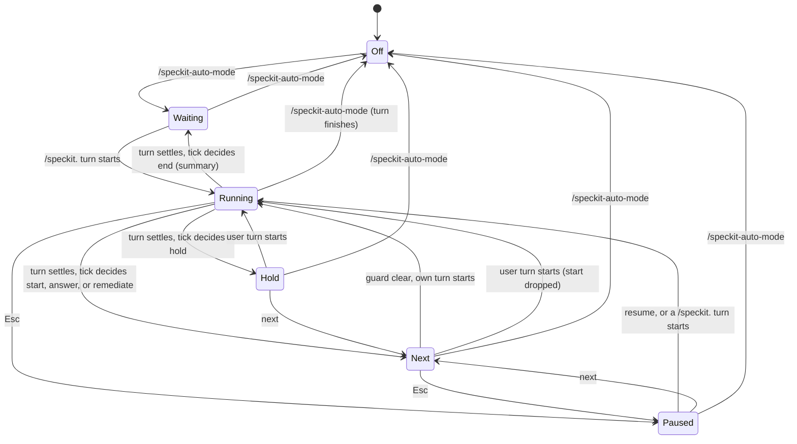

# Data Model: Speckit-Auto Mode

## Saved state (session entry)

The mode saves this object as the `data` of a `custom` session entry with `customType: "speckit-auto"`. The latest entry on the current branch wins.

```ts
type SpeckitPhase = "specify" | "clarify" | "plan" | "tasks" | "analyze" | "remediation" | "implement" | "converge";

interface SpeckitHold {
	kind: "user" | "needs-you"; // "user": waits for an answer. "needs-you": error, limit, or unreadable turn.
	reason: string;
}

interface SpeckitRun {
	phase: SpeckitPhase;
	history: SpeckitPhase[];   // every phase turn the run started, in order (FR-032 summary)
	remediationRounds: number; // 0..2
	convergeRounds: number;    // extra implement+converge rounds, 0..convergeLimit
	convergeLimit: number;     // speckitAuto.convergeRounds at run start
	autoAnswered: boolean;     // the automatic answer was sent in this phase run
	turnOpen: boolean;         // a run turn started and has not settled yet (cleared when the tick sees it settled, before the judge call)
	paused: boolean;
	hold?: SpeckitHold;
}

interface SpeckitAutoState {
	enabled: boolean;
	run?: SpeckitRun;
}
```

**Validation** (`parseSpeckitAutoState(data)`): an object with a boolean `enabled`. A `run` with an unknown phase, a non-array `history`, or a non-integer or negative count is dropped, and the rest of the state stays. Any other shape returns `undefined`, which means "mode off".

**Restore rule**: `enabled` turns the mode on. A restored `run` gets `paused = true`. Restore never classifies, parks, or submits. A restored `turnOpen: true` means omp quit during a turn, so resume sends the continue message.

## Transient state (InteractiveMode only, never saved)

| Field | Meaning |
|---|---|
| `#speckitGeneration: number` | Increments on a user turn start, Esc pause, mode off, `next`, `resume`, a new run, and session switch. Stale work compares and drops itself. |
| `#speckitDecidedKey: number \| undefined` | Timestamp of the last assistant message that the mode classified. |
| `#speckitTimer: Timer \| undefined` | The 800 ms tick (research R3). |
| `#speckitJudgeAbort: AbortController \| undefined` | Aborts the running judge call. Set while a check runs. |
| `#speckitParked: { text: string; phase: SpeckitPhase; generation: number } \| undefined` | A decided start that the next clear tick submits. |
| `#speckitOwnTurn: { text: string; phase: SpeckitPhase; generation: number } \| undefined` | The mode's own submission that waits for its `message_start`. Cleared by a match, a generation increment, or a tick that finds the guard clear (research R4). |
| `#speckitSubmitInFlight: number` | The editor submit handler runs (research R2). Blocks a submit. |
| `#speckitNextInFlight: boolean` | `next` awaits the abort. The tick does nothing. |

`speckitAutoActing` (for Esc) is true when a run is active, not paused, has no hold, and a run turn streams, `#speckitJudgeAbort` is set, or `#speckitParked` is set.

`speckitAutoRunActive` (for notification suppression) is true when the mode is on and a run is active and not paused.

## Turn verdict

```ts
interface SpeckitVerdict {
	failed?: string;                 // stopReason error, length, or aborted (an abort that did not come from Esc pause or next), with the reason
	completed: boolean | undefined;  // false: reported error or early stop. undefined: cannot tell.
	waits: boolean | undefined;
	routine: boolean;                // the only open question asks to proceed with the recommendation
	ready?: boolean;                 // clarify only
	analyze?: { critical: number; high: number } | "unreadable"; // analyze only
	fixed?: boolean;                 // analyze only, judge only: the user asked to fix the findings and the reply reports the fixes
	converge?: "complete" | "added" | "none";                    // converge only
}
```

## Actions

```ts
type SpeckitAction =
	| { kind: "start"; phase: SpeckitPhase }                         // submit `/speckit.<phase>`
	| { kind: "answer" }                                             // submit the automatic answer, set autoAnswered
	| { kind: "remediate" }                                          // submit the remediation prompt, remediationRounds + 1
	| { kind: "hold"; hold: SpeckitHold }
	| { kind: "end"; result: "complete" | "open-tasks" | "stopped" }
	| { kind: "notice"; text: string; after: SpeckitAction };        // HIGH-only analyze notice
```

## Decision table: `decideSpeckitStep(run, verdict)`

Checks run top to bottom. The first match wins. "Any" means every phase.

| # | Condition | Action |
|---|---|---|
| 1 | any, `failed` | hold needs-you: the failure reason |
| 2 | any, `waits === true`, phase specify, clarify, analyze, or remediation | hold user: "answer the question" |
| 3 | any, `waits === true`, `routine`, not `autoAnswered` (plan, tasks, implement, converge) | answer |
| 4 | any, `waits === true` | hold user |
| 5 | any, `completed === false` | hold needs-you: "the phase reported an error or stopped early" |
| 6 | specify or clarify, `waits === undefined` | hold needs-you: "cannot tell if the phase waits; `/speckit-auto next` advances" |
| 7 | specify, plan, tasks, implement, or remediation, `completed !== true` | hold needs-you: "cannot tell if the phase finished; `/speckit-auto next` advances" |
| 8 | specify | start clarify |
| 9 | clarify, `ready === true` | start plan |
| 10 | clarify | hold needs-you: "clarify did not report the spec ready" |
| 11a | analyze, `analyze` is `"unreadable"` or missing, `fixed === true`, `remediationRounds < 2` | start analyze (counts a remediation round when its turn starts) |
| 11b | analyze, `analyze` is `"unreadable"` or missing, `fixed === true` | hold needs-you: "fixes applied after 2 rounds; run /speckit.analyze to check them" |
| 11 | analyze, `analyze` is `"unreadable"` or missing | hold needs-you: "no readable analyze report" |
| 12 | analyze, `critical > 0`, `remediationRounds < 2` | remediate |
| 13 | analyze, `critical > 0` | hold needs-you: "N CRITICAL findings remain after 2 rounds" |
| 14 | analyze, `high > 0` | notice "N HIGH findings", then start implement |
| 15 | analyze | start implement |
| 16 | converge, `converge === "complete"` | end complete |
| 17 | converge, `converge === "added"`, `convergeRounds < convergeLimit` | start implement (convergeRounds + 1) |
| 18 | converge, `converge === "added"` | end open-tasks |
| 19 | converge | hold needs-you: "converge reported no result" |
| 20 | plan | start tasks |
| 21 | tasks | start analyze |
| 22 | remediation | start analyze |
| 23 | implement | start converge |

Notes:

- Row 2 comes first among the question rows: a question in specify, clarify, analyze, or remediation always goes to the user.
- Row 3 comes before row 5: the implement checklist gate stops before the work is done (`completed: false`) but is a routine question that FR-019 answers once. `routine` is true only when the message reports no error (research R6), so an error with a "proceed?" question still holds at row 4.
- Row 5 holds every phase on a reported error, including clarify, analyze, and converge, before any automatic start.
- Clarify, analyze, and converge do not need `completed === true`: their outcome cues (`ready`, the report, the converge result) are the proof.

## State transitions



**Run start and reset**: A `/speckit.specify` turn start always makes a new run: `phase: "specify"`, `history: ["specify"]`, zero counts, `convergeLimit` from the setting, `autoAnswered: false`, `turnOpen: true`, no pause, and no hold. Any other phase command with no active run starts a run at that phase with the same reset.

**Phase turn start**: When a phase turn starts (user command or own start), the mode sets `phase`, appends it to `history`, sets `autoAnswered = false` and `turnOpen = true`, and clears the hold and the pause. An own answer or continue turn keeps the phase. An answer turn sets `autoAnswered = true`.

**User turn start**: Any user turn start in an active run increments the generation, drops the parked start, clears the hold, and sets `turnOpen = true`. The phase stays.

**Successor map** (for `/speckit-auto next`): specify → clarify → plan → tasks → analyze → implement → converge → end. remediation → analyze.

## Bounds (SC-004)

Without user input, one run has at most:

- 1 clarify start (only row 8 starts clarify),
- 3 analyze turns (1 from tasks + 2 from remediation),
- 2 remediation rounds,
- 1 + `convergeLimit` implement turns,
- 1 automatic answer per phase run.
